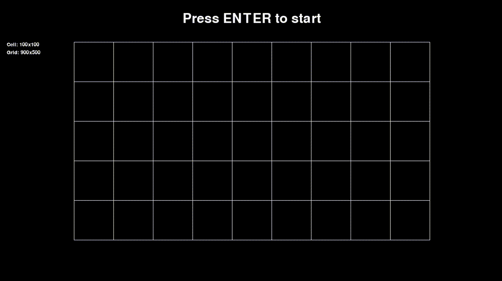

# Maze generator

> Generate a maze with the hunt-and-kill algorithm



## Setup

```sh
pipenv install
pipenv shell
python3 run.py
```

## Usage

| key | description |
|:-----|-------|
| `Enter` | Run algorithm |
| `R`     | Reset |
| `SCROLL` | Change cell size |
| hold `W` & `SCROLL` | Change grid width |
| hold `H` & `SCROLL` | Change grid height |
| `ESC`   | Exit program |
